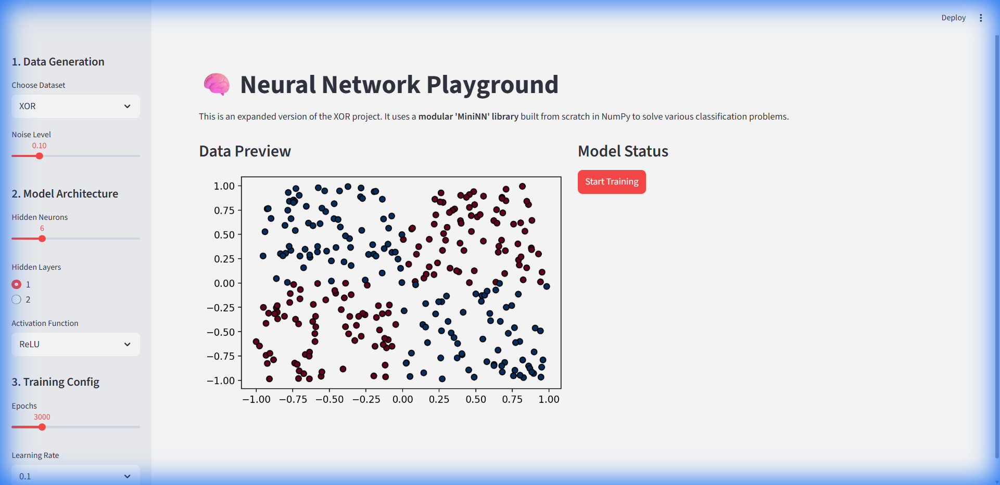

# Neural Network Playground 🧠

An interactive educational tool to visualize how Neural Networks learn, built from scratch using NumPy and Streamlit.

## Features

- **Modular MiniNN Library**: A custom-built neural network library (`mininn.py`) with:
  - Dense Layers
  - Activation Functions (ReLU, Sigmoid, Tanh)
  - Backpropagation engine
- **Interactive Playground**:
  - Choose datasets: XOR, Moons, Concentric Circles, Blobs.
  - Adjust noise levels.
  - Configure architecture (Hidden Neurons, Layers).
  - Watch the Decision Boundary evolve in real-time!

## Project Structure

- `mininn.py`: The core neural network library (Manual implementation).
- `app.py`: The Streamlit frontend interface.
- `xor_nn.py`: The original standalone script for solving XOR.
